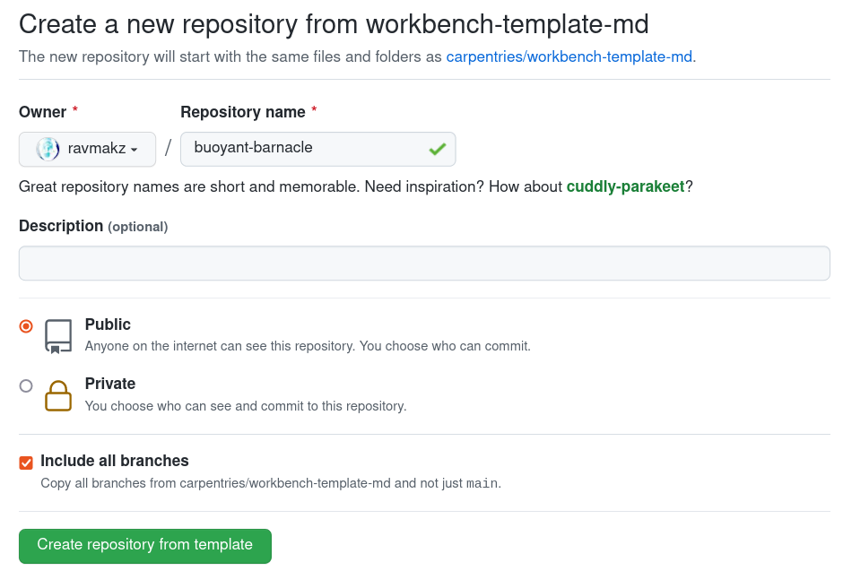

:::::::::::::::::::::::::::::::::::::: questions 

- How do we create lessons using a local Workbench installation?
- How do we create lessons using the online GitHub architecture?

::::::::::::::::::::::::::::::::::::::::::::::::

::::::::::::::::::::::::::::::::::::: objectives

- Demonstrate how to use local R and shell Workbench commands for creating a lesson 
- Demonstrate how to use the lesson template repositories to create a lesson repository on GitHub

::::::::::::::::::::::::::::::::::::::::::::::::

## Local Lesson Creation

Once `{sandpaper}` is installed, you can use various functions within the package to bootstrap new lessons from scratch based on a built-in template.

### Creating a Lesson Using Sandpaper

Let's start in a new folder in our home directory called `lessons`:

```bash
cd ~
mkdir lessons
cd lessons
```

Now let's fire up R and use `sandpaper::create_lesson()` to give us a starting point:

```bash
R
```

```r
library(sandpaper)
sandpaper::create_lesson("buoyant-barnacle")
```

All going well, command output should be generated and a new lesson in the directory `~/lessons/buoyant-barnacle`:

::::::::::::: callout

In these examples, we're assuming our Linux user is `captainhaddock`, so our home directory is `/home/captainhaddock`.

This will be different on your system!

:::::::::::::::::::::

```
> library(sandpaper)
> sandpaper::create_lesson("buoyant-barnacle")
No personal access token (PAT) available.
Obtain a PAT from here:
https://github.com/settings/tokens
For more on what to do with the PAT, see ?gh_whoami.
ℹ No schedule set, using Rmd files in episodes/ directory.
→ To remove this message, define your schedule in config.yaml or use `set_episodes()` to generate it.
──────────────────────────────────────────────────────────────────────────────────────
ℹ To save this configuration, use

set_episodes(path = path, order = ep, write = TRUE)
☐ Edit /home/captainhaddock/lessons/buoyant-barnacle/episodes/introduction.Rmd.
✔ First episode created in /home/captainhaddock/lessons/buoyant-barnacle/episodes/introduction.Rmd
! No GitHub token available. API rate limits may apply.
ℹ Downloading workflows from https://api.github.com/repos/carpentries/workbench-workflows/releases/latest
ℹ Workflows up-to-date!
ℹ Consent to use package cache provided
→ Searching for and installing available dependencies ...
→ Hydrating
Done!
Discovering package dependencies ... 
The following packages were discovered:

# ~/R/x86_64-pc-linux-gnu-library/4.5
- R6            2.6.1
- base64enc     0.1-6
- bslib         0.10.0
- cachem        1.1.0
- cli           3.6.6
- digest        0.6.39
- evaluate      1.0.5
- fastmap       1.2.0
- fontawesome   0.5.3
- fs            2.1.0
- highr         0.12
- htmltools     0.5.9
- jquerylib     0.1.4
- jsonlite      2.0.0
- knitr         1.51
- lifecycle     1.0.5
- memoise       2.0.1
- mime          0.13
- rappdirs      0.3.4
- rlang         1.2.0
- rmarkdown     2.31
- sass          0.4.10
- tinytex       0.59
- xfun          0.57
- yaml          2.3.12

They will be linked into the project library.

Done!king packages into the project library ... 
* Hydrated 25 packages in 44 milliseconds.
→ Recording changes in lockfile
The following package(s) will be updated in the lockfile:

# RSPM ===============================
- R6            [* -> 2.6.1]
- base64enc     [* -> 0.1-6]
- bslib         [* -> 0.10.0]
- cachem        [* -> 1.1.0]
- cli           [* -> 3.6.6]
- digest        [* -> 0.6.39]
- evaluate      [* -> 1.0.5]
- fastmap       [* -> 1.2.0]
- fontawesome   [* -> 0.5.3]
- fs            [* -> 2.1.0]
- highr         [* -> 0.12]
- htmltools     [* -> 0.5.9]
- jquerylib     [* -> 0.1.4]
- jsonlite      [* -> 2.0.0]
- knitr         [* -> 1.51]
- lifecycle     [* -> 1.0.5]
- memoise       [* -> 2.0.1]
- mime          [* -> 0.13]
- rappdirs      [* -> 0.3.4]
- rlang         [* -> 1.2.0]
- rmarkdown     [* -> 2.31]
- sass          [* -> 0.4.10]
- tinytex       [* -> 0.59]
- xfun          [* -> 0.57]
- yaml          [* -> 2.3.12]

# https://carpentries.r-universe.dev =
- renv          [* -> 0.17.0-38]

The version of R recorded in the lockfile will be updated:
- R             [* -> 4.5.0]

* Lockfile written to '~/lessons/buoyant-barnacle/renv/profiles/lesson-requirements/renv.lock'.
✔ Lesson successfully created in /home/captainhaddock/lessons/buoyant-barnacle
✔ Setting active project to "/home/captainhaddock/lessons/buoyant-barnacle".
✔ Changing working directory to /home/captainhaddock/lessons/buoyant-barnacle/
/home/captainhaddock/lessons/buoyant-barnacle
```

OK that's a lot of output! Let's look at some specific things first, starting at the top and working our way down:

#### Access Tokens

```
No personal access token (PAT) available.
Obtain a PAT from here:
https://github.com/settings/tokens
For more on what to do with the PAT, see ?gh_whoami.
```

When interacting with GitHub later on, you can do so by using Personal Access Tokens (PAT) that verify who you are to GitHub without needing to enter usernames and passwords.
This is very important in later stages of lesson management and maintenance, covered in the [GitHub section](TODO.md) of this documentation, but we can ignore this for now. 

#### Lesson Schedule

```
ℹ No schedule set, using Rmd files in episodes/ directory.
→ To remove this message, define your schedule in config.yaml or use `set_episodes()` to generate it.
──────────────────────────────────────────────────────────────────────────────────────
ℹ To save this configuration, use

set_episodes(path = path, order = ep, write = TRUE)
```

Lessons developers can provide summary timing schedules to help instructors plan their teaching.
By default, the lesson template does not include a schedule, so this is showing how you can use either the `set_episodes()` function to do so, or my manually editing the lesson configuration file, `config.yaml`.

We'll get into [utility commands for sandpaper](TODO.md) later.

#### Episodes

```
✔ First episode created in /home/captainhaddock/lessons/buoyant-barnacle/episodes/introduction.Rmd
```

`sandpaper` has created an empty episode for us called `introduction.md` in the `episodes/` directory.
This is a markdown file that represents the most basic element of a lesson - a text file with some Markdown content in it.

We'll be getting into [adding episodes](02-creation-templates.md) in a subsequent section.

#### Workflows

```
! No GitHub token available. API rate limits may apply.
ℹ Downloading workflows from https://api.github.com/repos/carpentries/workbench-workflows/releases/latest
ℹ Workflows up-to-date!
```

You can always manage your lesson locally, with no requirement to use GitHub.
However, most of the lessons that are developed are kept in GitHub or other git-compliant repository management services, e.g. GitLab.

So, Workbench lessons come with built-in workflows that are run by the GitHub Actions platform.
This part of the output shows `sandpaper` checking for any new updates to those workflows, but we're up to date so there's nothing to do.

We'll cover [GitHub Actions workflows](TODO.md) later.

::: callout

These workflows, stored in the `.github/` directory of a lesson, are not used in any way locally and only on GitHub.

:::


#### Lesson Dependencies

```
ℹ Consent to use package cache provided
→ Searching for and installing available dependencies ...
→ Hydrating
Done!
Dicovering package dependencies ... 
The following packages were discovered:

# ~/R/x86_64-pc-linux-gnu-library/4.5
- R6            2.6.1
- base64enc     0.1-6
- bslib         0.10.0
- cachem        1.1.0
- cli           3.6.6
- digest        0.6.39
- evaluate      1.0.5
- fastmap       1.2.0
- fontawesome   0.5.3
- fs            2.1.0
- highr         0.12
- htmltools     0.5.9
- jquerylib     0.1.4
- jsonlite      2.0.0
- knitr         1.51
- lifecycle     1.0.5
- memoise       2.0.1
- mime          0.13
- rappdirs      0.3.4
- rlang         1.2.0
- rmarkdown     2.31
- sass          0.4.10
- tinytex       0.59
- xfun          0.57
- yaml          2.3.12

They will be linked into the project library.

Done!king packages into the project library ... 
* Hydrated 25 packages in 44 milliseconds.
→ Recording changes in lockfile
The following package(s) will be updated in the lockfile:

# RSPM ===============================
- R6            [* -> 2.6.1]
- base64enc     [* -> 0.1-6]
- bslib         [* -> 0.10.0]
- cachem        [* -> 1.1.0]
- cli           [* -> 3.6.6]
- digest        [* -> 0.6.39]
- evaluate      [* -> 1.0.5]
- fastmap       [* -> 1.2.0]
- fontawesome   [* -> 0.5.3]
- fs            [* -> 2.1.0]
- highr         [* -> 0.12]
- htmltools     [* -> 0.5.9]
- jquerylib     [* -> 0.1.4]
- jsonlite      [* -> 2.0.0]
- knitr         [* -> 1.51]
- lifecycle     [* -> 1.0.5]
- memoise       [* -> 2.0.1]
- mime          [* -> 0.13]
- rappdirs      [* -> 0.3.4]
- rlang         [* -> 1.2.0]
- rmarkdown     [* -> 2.31]
- sass          [* -> 0.4.10]
- tinytex       [* -> 0.59]
- xfun          [* -> 0.57]
- yaml          [* -> 2.3.12]

# https://carpentries.r-universe.dev =
- renv          [* -> 0.17.0-38]

The version of R recorded in the lockfile will be updated:
- R             [* -> 4.5.0]

* Lockfile written to '~/lessons/buoyant-barnacle/renv/profiles/lesson-requirements/renv.lock'.
```

Whilst lessons can be written in basic Markdown, it's often the case that lesson developers want to include R code that runs when the lesson is built.
They do this by using the [RMarkdown format](TODO.md) to analyse data, produce plots, and more!
The Workbench includes these outputs automatically in the lesson content without the developer having to manually manage inserting images and so on.

As a result, R code within lessons might need extra packages, e.g. from BioConductor, ggplot, etc, to perform those tasks.
This part of the output refers to the `{renv}` package and other lesson dependencies, but we can ignore this for now.

More information on RMarkdown, `renv`, and package management is found in the [Using Code in Lessons](TODO.md) section. 

#### The Lesson Itself

```
✔ Lesson successfully created in /home/captainhaddock/lessons/buoyant-barnacle
✔ Setting active project to "/home/captainhaddock/lessons/buoyant-barnacle".
✔ Changing working directory to /home/captainhaddock/lessons/buoyant-barnacle/
/home/captainhaddock/lessons/buoyant-barnacle
```

These last few lines of output are telling us that everything went OK and where our lesson now lives.
Your folder names will look different, but the output should be similar to what you have on your system.

To help us along, `sandpaper` has set the current working directory as this new lesson directory, so we can get straight to work.


### What's Next?

We'll next cover the required and optional configuration options and parameters within the `config.yaml` file in the [next episode](02-creation-templates.md).

Alternatively, read on to learn how we can set up a new lesson completely within GitHub using our provided lesson template repositories.


## Creating a Lesson on GitHub

The process for creating a lesson repository on GitHub uses no local tools or Workbench packages like `{sandpaper}`.
Instead, we copy the template from an existing repository.

We provide two lesson template types: basic markdown and RMarkdown. These are available in two Carpentries repositories, [workbench-template-md][md-template] and [workbench-template-rmd][rmd-template]. 
We'll use the RMarkdown template in this example.

::: callout

It is important to note that if you choose the basic markdown template, you cannot (easily) then use RMarkdown code in that lesson.
However, if selecting the Rmarkdown template, you can include both basic markdown and RMarkdown episodes.

So if you are in doubt about which template to choose, use the RMarkdown version as it supports both routes.

:::

### Step 1: Choose a template

Pick one of the following templates by clicking one of the links below:

 - [Markdown Lessons (no generated content)](https://github.com/carpentries/workbench-template-md/generate) (if your lesson will not include R code examples, use this template)
 - [R Markdown Lessons (generated content via R)](https://github.com/carpentries/workbench-template-rmd/generate) (our tutorial uses this template)

A new browser page will open with a form to fill out to perform the copy of the template into your own account or organisation.

### Step 2: Choose a name for your lesson repository. 

Name it "buoyant-barnacle".

**Ensure "Include All Branches" is selected**.

Click on the button that says "Create repository from template"

::::::::::::: callout

#### Creating a new lesson repository

{alt="Screenshot of a webform that says
'Create a new repository from workbench-template-md'.
It says that the new repository will contain the same files and folders as carpentries/workbench-template-md and has two required fields for Owner and Repository Name, which are filled in as `ravmakz` and `buoyant-barnacle`.
There is a blank Description option, a radio button that selects public/private, and a checked checkbox to include all branches"}

::::::::::::::::::::

This step may take a short while to complete, but when it has finished processing, your browser will take you to your new lesson repository.

### Step 3: Clone your lesson locally

::::::::::::: callout

There are other ways to build lessons, covered later on, but for now let's use a local install of the Workbench to continue. 

Make sure you have a working Workbench install, as per the [installation instructions](../learners/local_install.md).

:::::::::::::::::::::

Now that you have a lesson repository in your GitHub account or organisation, clone it locally so we can move on to the build process.

Let's start in a new folder in our home directory called `lessons`, and use `git clone` to download the lesson. To get your lesson URL for cloning, go to your lesson repository's main page and click the `<> Code` button. Make sure you're in the Local tab of the popup that appears, and select either the HTTPS or SSH tab underneath. Click the `Copy URL to Clipboard` button (an icon with two overlapping squares) to the right of the URL box. 

::::::::::::: callout

SSH is the preferred method, so please set up SSH access keys as per [the GitHub documentation](TODO.md) when you're ready to do so if you haven't already!

:::::::::::::::::::::

For SSH the URL will be something like `git@github.com:captainhaddock/buoyant-barnacle.git`.

For HTTPS the URL will be something like `https://github.com/captainhaddock/buoyant-barnacle.git`.

Head to a terminal to continue, and when calling the `git clone` command, paste in the URL you copied.

```bash

# Make sure `captainhaddock` is your own GitHub account or organisation!

cd ~
mkdir lessons
cd lessons
git clone git@github.com:captainhaddock/buoyant-barnacle.git
cd buoyant-barnacle

```

We're ready to start building the lesson!

::::::::::::::::::::::::::::::::::::: keypoints 

- A new Workbench lesson comprising a boilerplate episode and configuration can be created locally with `sandpaper::create_lesson`
- A new lesson repository can be created on GitHub by copying one of the provided Markdown or RMarkdown lesson templates
- A lesson created on GitHub can be cloned locally, as if you had created it locally
- There's no right or wrong way to create a lesson - it's completely down to preference - but if you want to add R code later on in lesson development, start with the RMarkdown template.

::::::::::::::::::::::::::::::::::::::::::::::::
